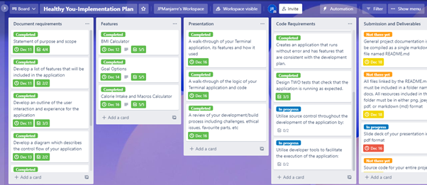
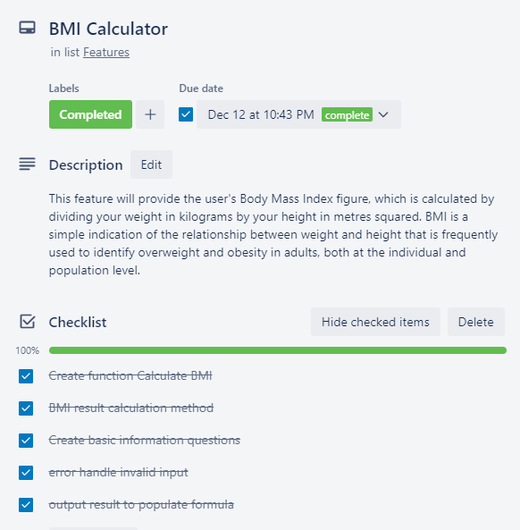
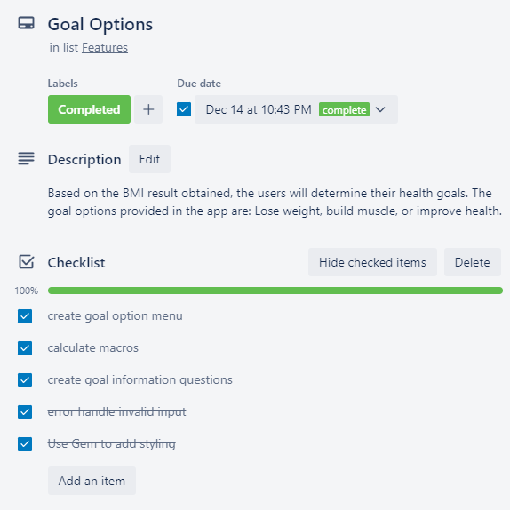
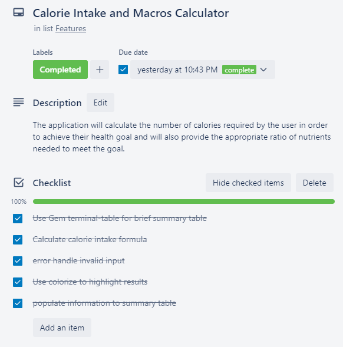

# README DOCUMENTATION 

## Link to Source Control Repository

A link to my source control repository can be found [here](https://github.com/jpmanjarres/JuanManjarres_T1A3)

# **Software Development Plan**

## **Healthy You Overview**

Healthy You is a health and nutrition calculator that will help you establish whether you are in a healthy weight range for your height and the recommended approach to achieve a healthier weight and improve your wellbeing.

With this tool, the users can easily know all the details of their fitness and find out those aspects that they should improve.

Firstly, it will request some basic information to assess your weight to determine your current Body Mass Index (BMI).

Next, the app will inform the user of its current weight range (underweight, Normal weight, overweight, obese).

Once the user has learned its BMI, the app will provide 3 options to continue personalising a health plan to suit the users’ fitness goal.

Finally, the user will receive a breakdown of the calorie intake required to achieve their fitness goal and the macros within the allowed calories.

### **Statement of Purpose**

The purpose of the application is to help the user determine their overall fitness based on their BMI and provide a personalised target for daily calorie intake and macros.

By tracking your calories, you can better know if you are eating the right amount of food for your goals. However, tracking calories alone does not ensure you are getting an appropriate amount of macronutrients for your body, goals, and preferences. Depending on what you are trying to achieve, this can negatively affect your appetite, hormones, energy levels, and nutrient consumption.

The Healthy You app, will provide a customised health plan by adjusting your macronutrient ratio based on your age, sex, activity levels, and goals, which will help you optimise your eating plan.

The scope of the application will include the following:

1. Basic information questions, such as, age, gender, height, and weight. The information is used to calculate current BMI of the user and current health level.

2. Further questions required to personalise a healthy eating ratio and calorie intake to aid the user in achieving its goal. These questions include:

-	Desired weight

-	Timeframe

-	Current activity level

### **Target Audience** 

The target audience for Healthy You, is people that are interested or concerned about their current fitness level and would like to take the next step in working towards a healthier lifestyle.

The users will utilise this tool to easily understand all the details of their fitness and find out those aspects that you need to be improved.  

## **Features**

The user will initially be welcomed to Healthy You, and a brief summary of what the application can be used for. Then, the application will ask the user to enter their name. After the user enters their name, the application will ask some basic information, such as, age, gender, height, and weight. It will then calculate the users BMI range and explain briefly what this means.

### **Feature 1** 

**BMI calculation: This feature will provide the users Body Mass Index figure, which is calculated by dividing your weight in kilograms by your height in metres squared. BMI is a simple indication of the relationship between weight and height that is frequently used to identify overweight and obesity in adults, both at the individual and population level.**

Once the user knows their current fitness/health level, they will be able to choose a health plan based on the goal they want to achieve. In order to do so, the application will request some further information from the user, such as, goal weight, expected date they want to achieve this result, and their current level of physical activity.

### **Feature 2** 

**Goal options: Based on the BMI result obtained, the users will determine its health goal. The goal options provided in the app are: Lose weight, build muscle, or improve health.**

As a result, the application will calculate and provide the number of daily calorie intake required to achieve their goal, and the healthy ratio of nutrients needed within the calculated amount of calories.

### **Feature 3**

**Calorie intake and macros calculator: The application will calculate the number of calories required by the user in order to achieve their health goal and will also provide the appropriate ratio of nutrients needed to meet the goal.**

The calculator will only output realistic results. For example, if the user expects to lose too much weight within a very short amount of time, the calculator will advice that the outcome is unrealistic, and it is not possible to achieve the goal within the expected time frame.

## **Outline of User Interaction** 

### **Welcome to the application**

-	The user is initially welcomed with the heading "Welcome to Healthy You."

-	The user will receive a brief description of the purpose of the application and what it can be used for.

-	The user will need to press enter to continue.

-	The user is then asked to enter its name.

The application will reply with a personalised sentence: “Hi (user’s name), there is some basic information we need before we start”

####	**Feature 1**

The user will be prompted to answer 4 questions:

What is your age?

What is your biological sex?

What is your height in Metres?

What is your current weight in Kilograms?

The application will thank the user for providing the information.

After that, the application will calculate the users’ BMI and provide a brief description about why it is important to know the BMI: “Based on the information provided, we have calculated your BMI” “Your current BMI is xxx”

The user will get an explanation of what the BMI number means for its health. It will say whether the user is at a normal weight, underweight, overweight, or obese.

####	**Feature 2**

1. The application will display a menu, which provides the user with the option to choose from three different approaches for their health journey.

“What is your goal?”

Option 1: Lose weight

Option 2: Build Muscle

Option 3: Improve health

 Once the user chooses the preferred option, the application will require some further questions to proceed.

How much do you want to weight? (kg)

By when (days)?

How much exercise do you do weekly? (No exercise at all, Light, Moderate, Intense, Other(hrs)

####	**Feature 3**

- The application will output a brief summary with the users’ details:

	Brief Summary

	Age: xx

	Current weight: xx

	BMI: xx

- The user will receive the result of the calculation: “To reach your goal of XX KGs in XX months at your current body weight and activity level, requires XX calories per day”

And here is how that breaks down:

Weight loss: XX% Carbs, XX% Fats, XX% Protein

Muscle gain: XX% Carbs, XX% Fats, XX% Protein

Improve health: XX% Carbs, XX% Fats, XX% Protein

#### Exit

-   Farewells the user and exits the application.

## Control Flow Diagram

## **Implementation Plan**

I used a Trello board by Trello software to aid in the planning and implementation process.

More of my Trello Board and Implementation Plan can be found in the below link [https://trello.com/b/0tvcmxR1/healthy-you-implementation-plan](https://trello.com/b/0tvcmxR1/healthy-you-implementation-plan)

### **Main Trello Board**

## **Help Documentation**

### **Installation Instructions**

1. Please install Ruby on your computer to run this program. for instructions on how to install Ruby.

2. In addition to Ruby, the following Ruby Gem dependencies will need to be installed to successfully run the Healthy You application:
	
gem "tty-prompt", "~> 0.23.1"

gem "colorize", "~> 0.8.1"

gem "terminal-table", "~> 3.0"

gem "pastel", "~> 0.8.0"

gem "tty-progressbar", "~> 0.18.2"

gem "tty-box", "~> 0.7.0"

To install the required Ruby gems through the command line using the following commands:

For tty-prompt: 

`gem install tty-prompt`

For colorize: 

`gem install colorize`

For terminal-table: 

`gem install terminal-table`

For pastel:

`gem install pastel`

For tty-progressbar:

`gem install tty-progressbar`

For tty-box:

`gem install tty-box`

3. This repository will need to be cloned to your local machine. By selecting the green clone button beneath settings in the top right-hand corner, you can duplicate the repository.

### Running Healthy

A bash script file is used to execute the Healthy You application from the command line. Complete the instructions below after installing Ruby and the Gem requirements.

1. Open your terminal

3. Change directories to the source directory where this folder is store

4. In the source directory, run the following command to execute the program:

`./run_app.sh`

## **Referenced Sources**

Ruby-lang.org. (2019). Download Ruby. [online] Available at: [https://www.ruby-lang.org/en/downloads/](https://www.ruby-lang.org/en/downloads/) [Accessed 14 December 2021].

Body Mass Index calculator. [online] Available at: [https://www.diabetes.ca/managing-my-diabetes/tools---resources/body-mass-index-(bmi)-calculator#:~:text=Body%20Mass%20Index%20is%20a,most%20adults%2018%2D65%20years](https://www.diabetes.ca/managing-my-diabetes/tools---resources/body-mass-index-(bmi)-calculator#:~:text=Body%20Mass%20Index%20is%20a,most%20adults%2018%2D65%20years). [Accessed 10 December 2021]

Basal energy calculator. (2021). [online] Available at: [https://www.mydr.com.au/tools/basal-energy-calculator/](https://www.mydr.com.au/tools/basal-energy-calculator/) [Accessed 11 December 2021]
